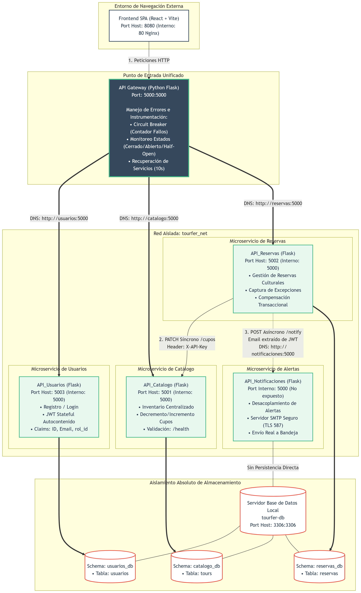

# TourFer: Sistema de Gestión de Reservas de Tours


Plataforma distribuida y desacoplada basada en microservicios, diseñada para centralizar la oferta de experiencias turísticas y culturales. El sistema proporciona un entorno seguro, escalable y tolerante a fallos mediante una estrategia de aislamiento perimetral y almacenamiento independiente (*Database-per-Service*).

---

## 1. Componentes y Arquitectura

* **Frontend (Puerto 8080):** Interfaz de usuario SPA construida sobre React y Vite, gestionada mediante Nginx.
* **API Gateway (Puerto 5000):** Fachada única de entrada que actúa como proxy inverso y disyuntor (*Circuit Breaker*), controlando el ruteo interno de la red virtual de Docker.
* **Microservicio de Usuarios (Puerto 5003):** Gestiona el registro, autenticación de credenciales mediante Bcrypt y emisión de tokens JWT.
* **Microservicio de Catálogo (Puerto 5001):** Administra la oferta turística y el control estricto de cupos disponibles mediante la API de catálogo.
* **Microservicio de Reservas (Puerto 5002):** Orquestador transaccional que valida cupos de manera síncrona contra el catálogo vía HTTP y aplica políticas de compensación.
* **Microservicio de Notificaciones (Canal Privado):** Servicio asíncrono no bloqueante para el envío de vouchers en formato HTML vía SMTP (TLS).

**Stack Tecnológico:**
* **Frontend:** React, Vite, Axios, React Router Dom
* **Backend:** Python / Flask (Flask-CORS, Flask-Bcrypt, Flask-JWT-Extended)
* **Base de Datos:** MySQL 8.0 (con aislamiento físico de esquemas: `usuarios_db`, `catalogo_db`, `reservas_db`)
* **Comunicación y Seguridad:** RESTful API (HTTP), JWT, firmas simétricas (`X-API-Key`)
* **Orquestación:** Docker & Docker Compose, Nginx

---

## 2. Instrucciones de Ejecución

### Requisitos Previos:
* [Docker Desktop](https://www.docker.com/) (Versión 20.10 o superior) instalado y habilitado.
* Docker Compose V2.
    
### Pasos para el Despliegue:

1. **Configuración del Entorno:**
   * Localice el archivo `.env.example` en la raíz del proyecto, cree una copia y renómbrela a `.env`.
   * Complete las variables de configuración con sus credenciales del servidor de correo emisor y claves de seguridad:
     ```text
     SMTP_SERVER=smtp.gmail.com
     SMTP_PORT=587
     SMTP_EMAIL=tu_cuenta_emisora@gmail.com
     SMTP_PASSWORD=tu_clave_de_aplicacion
     CATALOGO_API_KEY=clave_secreta_de_intercomunicacion
     JWT_SECRET_KEY=clave_secreta_para_tokens
     ```

  2. **Limpieza y Construcción (Recomendado):**
   ```bash
   docker-compose down -v
   docker-compose up --build 
   ```

  3. **Verificación de contenedores:**

   ```bash
   docker logs -f tourfer-db
   ```


## 3. Descripción de Endpoints

Todas las peticiones públicas del cliente deben apuntar exclusivamente a la dirección base del API Gateway: http://localhost:5000

### Autenticación (Usuarios)

**Gestiona la identidad de los usuarios del sistema.**

   * **POST /register:** Registra un nuevo usuario en el sistema.

   * **POST /login:** Autentica credenciales y retorna el token JWT de acceso.

     
### Catálogo de Tours:

**Mantiene la información técnica de los paquetes turísticos.**

   * **GET /tours:** Retorna el listado completo de tours disponibles.

   * **GET /tours/id_tour:** Retorna el detalle de un tour específico.
     
   * **PATCH /tours/cupos:** Modificación interna del inventario (Protegido por cabecera de seguridad simétrica).
     
     
### Reservas:

**Orquestador de la lógica de negocio de compra.**

   * **POST /reservas:** (Protegido) Crea una reserva validando cupos y actualizando el inventario en cascada.

   *  **GET /mis-reservas:** (Protegido) Historial de reservas del usuario en sesión.

   *  **POST /notify:** (Privado interno) Envío del voucher de reserva vía SMTP.
     

## 4. Estructura de Datos y Persistencia

El sistema utiliza un motor centralizado de MySQL 8.0 que opera con tres esquemas lógicos independientes para garantizar la separación de dominios:

   * **usuarios_db:** Almacena perfiles, credenciales cifradas y roles.

   * **catalogo_db:** Almacena el inventario de paquetes turísticos y disponibilidad de cupos.

   * **reservas_db:**Almacena el historial transaccional de compras y compras asociadas.
     
La persistencia está garantizada mediante volúmenes nombrados de Docker, asegurando que la información prevalezca ante reinicios de contenedores.

## 5. Integración de Servicios

* **Database-per-Service:** Cada microservicio posee un aislamiento estricto de su persistencia relacional.

* **Circuit Breaker (API Gateway):** Controla estados de fallo (Closed, Open, Half-Open) para proteger a los servicios internos de sobrecargas masivas.

* **Compensación Transaccional:** Si una reserva falla tras haberse procesado el descuento de cupos en el catálogo, el sistema ejecuta una petición inversa automatizada para restaurar el inventario afectado.

## 6. Guía de Pruebas y Validación
   1. **Acceso a la Interfaz:** Ingresa a http://localhost:8080 para interactuar directamente con la SPA de React.
   2. **Prueba del Gateway:** Valida la disponibilidad del enrutador perimetral en http://localhost:5000/health.
   3. **Flujo de Autenticación y Reserva:** Usa Postman para enviar un POST a http://localhost:5000/register, obtén tu token en */login*, y utilízalo en la cabecera *Authorization: Bearer <token>* para consumir *POST /reservas*.

## Diagrama de Arquitectura


